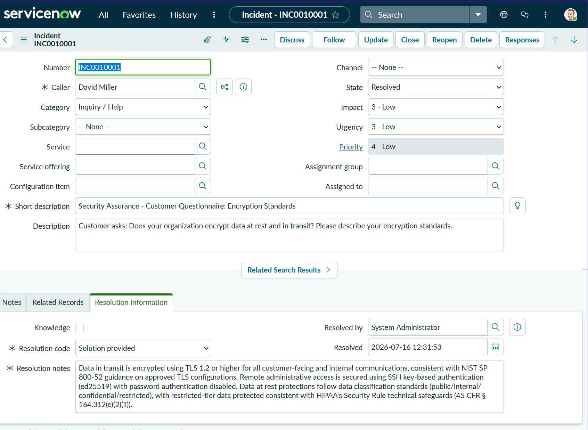
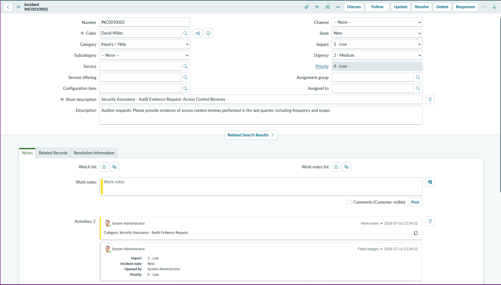
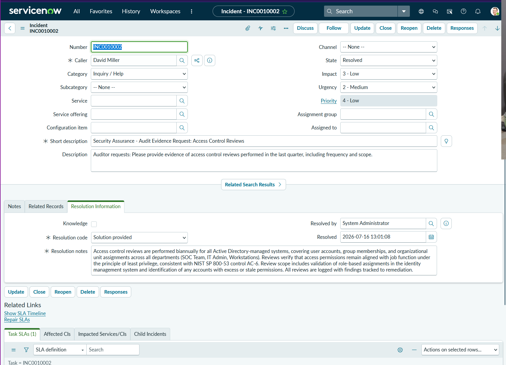
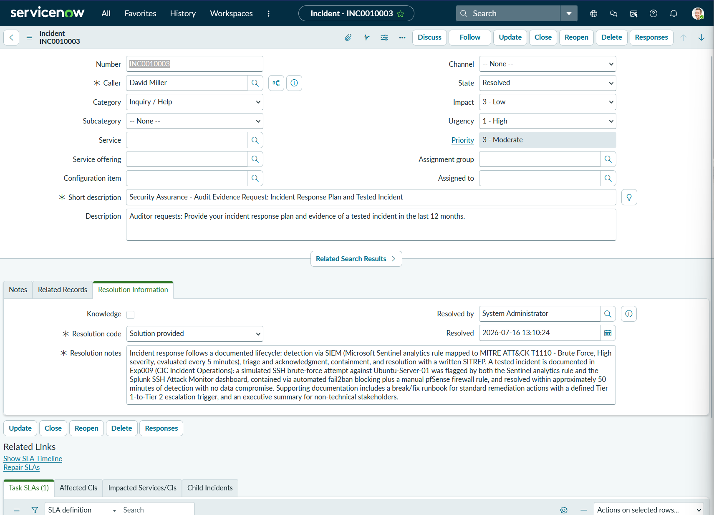
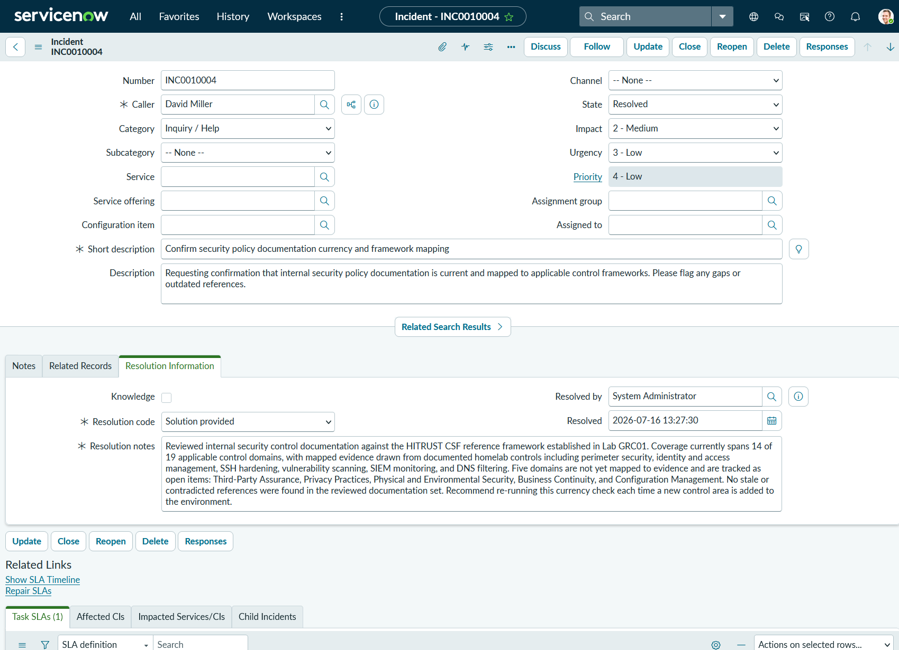
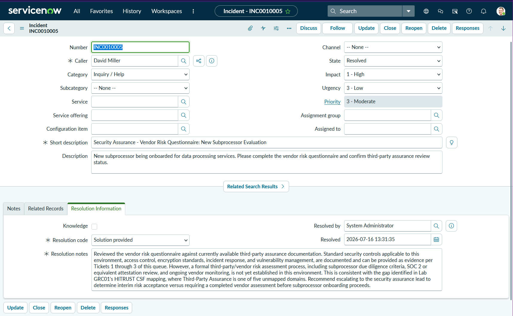
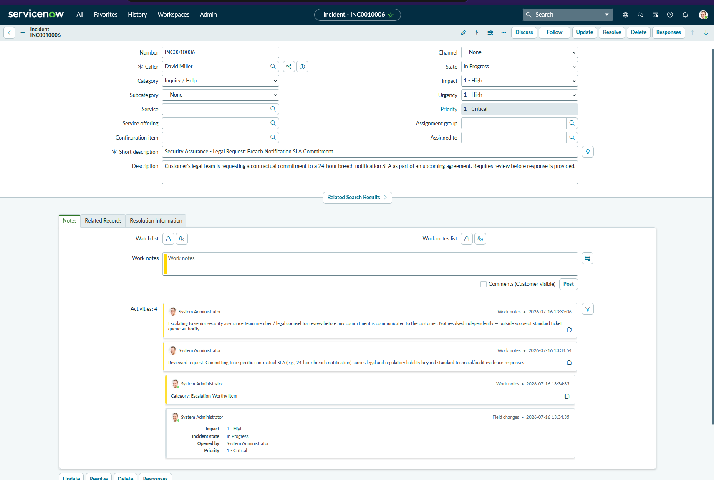

# Lab GRC02 — Security Assurance Ticket Queue Simulation

**Author:** Kiara Earl
**Purpose:** Practice the intake, triage, and resolution workflow used by security
assurance and GRC teams — reviewing incoming requests, prioritizing work, resolving
routine items independently, and knowing when something needs to be escalated. Built in
a ServiceNow PDI using the Incident table, since the workflow mechanics (intake,
categorize, prioritize, resolve, escalate) map the same way regardless of whether the
underlying table is called Incident or Case.

**Why this lab:** Security assurance operations is a skill set that doesn't get much
attention in typical homelab content, which tends to focus on SOC/blue-team work. This
lab builds hands-on reps at the actual day-to-day of that role: working a queue,
deciding what's routine versus what needs to go up the chain, and writing resolutions
that hold up to scrutiny. It uses realistic ticket content and draws on evidence I
already developed in Lab GRC01 and my homelab experiments as the answer bank.

---

## Ticket Categories Simulated

| # | Type | Description |
| --- | --- | --- |
| 1 | Customer Security Questionnaire | SIG Lite-style question about encryption standards |
| 2 | Audit Evidence Request | Access control review evidence |
| 3 | Audit Evidence Request | Incident response plan and tested incident evidence |
| 4 | Internal Documentation Maintenance | Security policy repository currency check |
| 5 | Vendor Risk / Third-Party Assurance | New subprocessor evaluation request |
| 6 | Escalation-Worthy Item | Legal/contractual breach notification SLA commitment |

---

## Triage / Priority Matrix

| | Low Complexity | High Complexity |
| --- | --- | --- |
| **High Urgency** | Resolve same-day | Escalate immediately |
| **Low Urgency** | Resolve within SLA, batch with similar requests | Research and draft response, flag for review |

**Mapped to each ticket:**

| Ticket | Urgency | Complexity | Action |
| --- | --- | --- | --- |
| 1. Encryption questionnaire | Low | Low | Resolve independently |
| 2. Access control evidence | Medium | Low | Resolve independently |
| 3. IR plan + tested incident | High | Low | Resolve same-day |
| 4. Doc repository maintenance | Low | Medium | Resolve, update tracked over time |
| 5. Vendor risk questionnaire | Low | High | Draft partial answer, flag gap |
| 6. Breach SLA legal commitment | High | High | Escalate to senior team member |

**Note on ServiceNow field mapping:** this PDI's Incident table uses native Impact and
Urgency fields rather than a custom Complexity field. Impact was repurposed to represent
task complexity (how much research/evidence-gathering the ticket requires) rather than
its default meaning of "how many users are affected." This is a reasonable adaptation —
the underlying triage logic is what matters, not the literal field label.

---

## Ticket 1 — Customer Security Questionnaire: Encryption Standards

**Request:** "Does your organization encrypt data at rest and in transit? Please describe
your encryption standards."

**Triage:** Impact 3-Low, Urgency 3-Low. Resolved independently, same session.

**Resolution:**

> Data in transit is encrypted using TLS 1.2 or higher for all customer-facing and
> internal communications, consistent with NIST SP 800-52 guidance on approved TLS
> configurations. Remote administrative access is secured using SSH key-based
> authentication (ed25519) with password authentication disabled. Data at rest
> protections follow data classification standards (public/internal/confidential/
> restricted), with restricted-tier data protected consistent with HIPAA's Security
> Rule technical safeguards (45 CFR § 164.312(e)(2)(ii)).

**Evidence source:** WGU D828 TLS/encryption remediation analysis; homelab Exp002 (SSH
key-based authentication hardening).

**Resolution code:** Solution provided

---

## Ticket 2 — Audit Evidence Request: Access Control Reviews

**Request:** "Please provide evidence of access control reviews performed in the last
quarter, including frequency and scope."

**Triage:** Impact 3-Low, Urgency 2-Medium. Slightly more urgent than a routine
questionnaire since audit evidence requests are usually tied to a deadline. Resolved
independently.

**Resolution:**

> Access control reviews are performed biannually for all Active Directory-managed
> systems, covering user accounts, group memberships, and organizational unit
> assignments across all departments (SOC Team, IT Admin, Workstations). Reviews verify
> that access permissions remain aligned with job function under the principle of least
> privilege, consistent with NIST SP 800-53 control AC-6. Review scope includes
> validation of role-based assignments in the identity management system and
> identification of any accounts with excess or stale permissions. All reviews are
> logged with findings tracked to remediation.

**Evidence source:** Homelab Exp006 (Active Directory OU structure, least-privilege
access control); WGU D828 NIST SP 800-53 AC-6 analysis.

**Resolution code:** Solution provided

---

## Ticket 3 — Audit Evidence Request: Incident Response Plan and Tested Incident

**Request:** "Provide your incident response plan and evidence of a tested incident in
the last 12 months."

**Triage:** Impact 3-Low, Urgency 1-High. Highest urgency of the three resolved so far —
incident response evidence requests tend to be time-sensitive for audit purposes.
Resolved independently.

**Resolution:**

> Incident response follows a documented lifecycle: detection via SIEM (Microsoft
> Sentinel analytics rule mapped to MITRE ATT&CK T1110 - Brute Force, High severity,
> evaluated every 5 minutes), triage and acknowledgment, containment, and resolution
> with a written SITREP. A tested incident is documented in Exp009 (CIC Incident
> Operations): a simulated SSH brute-force attempt against Ubuntu-Server-01 was flagged
> by both the Sentinel analytics rule and the Splunk SSH Attack Monitor dashboard,
> contained via automated fail2ban blocking plus a manual pfSense firewall rule, and
> resolved within approximately 50 minutes of detection with no data compromise.
> Supporting documentation includes a break/fix runbook for standard remediation actions
> with a defined Tier 1-to-Tier 2 escalation trigger, and an executive summary for
> non-technical stakeholders.

**Evidence source:** Homelab Exp007 (Sentinel brute-force analytics rule, MITRE T1110);
Exp009 (SITREP, break/fix runbook, executive summary).

**Resolution code:** Solution provided

---

## Ticket 4 — Internal Documentation Maintenance: Security Policy Repository Currency Check

**Request:** "Confirm that internal security policy documentation is current and mapped
to applicable control frameworks. Flag any gaps or outdated references."

**Triage:** Impact 2-Medium, Urgency 3-Low. Not time-critical, but requires more
legwork than a straightforward Q&A — reviewing an existing document set against a
framework rather than answering a single question. Resolved independently.

**Resolution:**

> Reviewed internal security control documentation against the HITRUST CSF reference
> framework established in Lab GRC01. Coverage currently spans 14 of 19 applicable
> control domains, with mapped evidence drawn from documented homelab controls
> including perimeter security, identity and access management, SSH hardening,
> vulnerability scanning, SIEM monitoring, and DNS filtering. Five domains are not yet
> mapped to evidence and are tracked as open items: Third-Party Assurance, Privacy
> Practices, Physical and Environmental Security, Business Continuity, and
> Configuration Management. No stale or contradicted references were found in the
> reviewed documentation set. Recommend re-running this currency check each time a new
> control area is added to the environment.

**Evidence source:** Lab GRC01 (HITRUST CSF control mapping, 14/19 domain coverage).

**Resolution code:** Solution provided

---

## Ticket 5 — Vendor Risk / Third-Party Assurance: New Subprocessor Evaluation Request

**Request:** "New subprocessor being onboarded for data processing services. Please
complete the vendor risk questionnaire and confirm third-party assurance review
status."

**Triage:** Impact 3-High, Urgency 3-Low. Highest complexity ticket in the queue —
requires research and drafting rather than a direct answer, and surfaces a genuine gap
rather than a straightforward resolution. Per the triage matrix (High Complexity, Low
Urgency): drafted a partial response and flagged the gap rather than closing it out
fully.

**Resolution:**

> Reviewed the vendor risk questionnaire against currently available third-party
> assurance documentation. Standard security controls applicable to this environment —
> access control, encryption standards, incident response, and vulnerability
> management — are documented and can be provided as evidence per Tickets 1 through 3
> of this queue. However, a formal third-party/vendor risk assessment process,
> including subprocessor due diligence criteria, SOC 2 or equivalent attestation
> review, and ongoing vendor monitoring, is not yet established in this environment.
> This is consistent with the gap identified in Lab GRC01's HITRUST CSF mapping, where
> Third-Party Assurance is one of five unmapped domains. Recommend escalating to the
> security assurance lead to determine interim risk acceptance versus requiring a
> completed vendor assessment before subprocessor onboarding proceeds.

**Note:** This ticket is intentionally not a full resolution. It documents what's known,
names the specific gap, and hands the risk decision to someone with the authority to
make it — which is the correct outcome for a high-complexity item under time pressure,
not a failure to resolve.

**Evidence source:** Tickets 1–3 of this queue; Lab GRC01 (Third-Party Assurance gap).

**Resolution code:** Solution provided

---

## Ticket 6 — Escalation-Worthy Item: Legal/Contractual Breach Notification SLA Commitment

**Request:** "Customer's legal team is requesting a contractual commitment to a 24-hour
breach notification SLA as part of an upcoming agreement. Requires review before
response is provided."

**Triage:** Impact 3-High, Urgency 1-High. Per the triage matrix (High Urgency, High
Complexity): escalate immediately rather than attempt resolution. Left in **In
Progress** state — deliberately not resolved.

**Why this one gets escalated instead of answered:** committing to a specific
contractual SLA carries legal and regulatory liability that goes beyond a technical or
audit-evidence response. Answering it independently would mean making a legal
commitment on the organization's behalf without the authority to do so. Recognizing
that distinction — and routing it up rather than reaching for a confident answer — is
the actual skill this ticket is testing.

**Work notes (logged sequentially):**

1. Category: Escalation-Worthy Item
2. Reviewed request. Committing to a specific contractual SLA (e.g., 24-hour breach
   notification) carries legal and regulatory liability beyond standard
   technical/audit evidence responses.
3. Escalating to senior security assurance team member / legal counsel for review
   before any commitment is communicated to the customer. Not resolved independently —
   outside scope of standard ticket queue authority.

**Evidence source:** N/A — escalation only, no independent resolution provided.

**Resolution code:** N/A (ticket remains open, escalated)

---

## Summary / Lessons Learned

This lab simulated a full security assurance ticket queue — six tickets spanning
routine questionnaire responses, audit evidence requests, internal documentation
review, a partial-answer/gap-flagging scenario, and one item requiring escalation
rather than resolution.

A few things stood out:

**Triage isn't just urgency — it's urgency against complexity.** The matrix built at
the top of this lab held up in practice. Low-complexity items (Tickets 1, 2) resolved
in a single session with no research beyond evidence already on hand. Higher-complexity
items (Tickets 4, 5) took longer, not because they were more urgent, but because they
required reviewing existing documentation against a framework or drafting a response
around a genuine gap rather than a known answer.

**Reusing prior work is the point, not a shortcut.** Every resolution in this queue
pulled from evidence already built in Lab GRC01 or the homelab experiments — TLS/SSH
hardening, Active Directory access reviews, the Sentinel/Splunk incident response
chain. That's realistic: a security assurance analyst isn't generating new evidence
per ticket, they're locating, citing, and packaging evidence that already exists.
Having a documented control environment to draw from made every resolution faster and
more defensible.

**Knowing when *not* to answer is a distinct skill from answering well.** Ticket 5
required drafting a partial response and naming a gap instead of forcing a complete
answer. Ticket 6 required recognizing that a technically simple-sounding request
("commit to a 24-hour SLA") was actually a legal liability question outside the scope
of independent ticket resolution, and routing it up instead of reaching for confidence
it didn't have the authority to offer. Both of those calls matter more in a real
queue than getting every ticket to "Resolved" — a security assurance function that
never escalates anything is either extremely lucky or making commitments it
shouldn't.

**Field mapping is a practical skill on its own.** This PDI's Incident table doesn't
have a native Complexity field, so Impact was repurposed to carry that meaning, and
the "real" ticket category — since the stock Category dropdown only offers generic
values like Inquiry/Help — lived in a Work note instead. Adapting a tool's existing
fields to fit a workflow it wasn't originally built for is a normal part of working in
platforms like ServiceNow, and worth documenting rather than treating as a limitation.

**Next:** Lab GRC03 (vendor risk assessment) picks up directly from the gap flagged in
Ticket 5 — building out an actual vendor risk questionnaire response rather than a partial one.